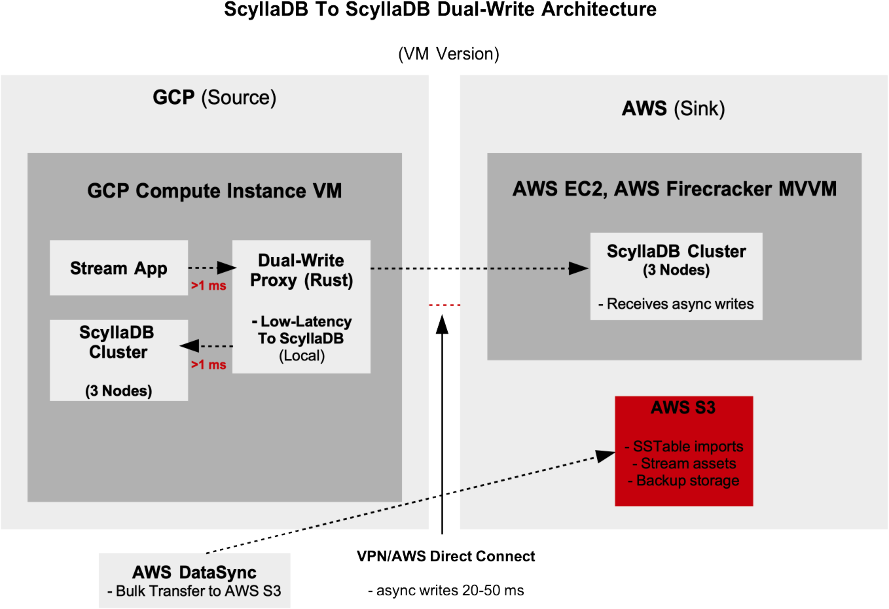
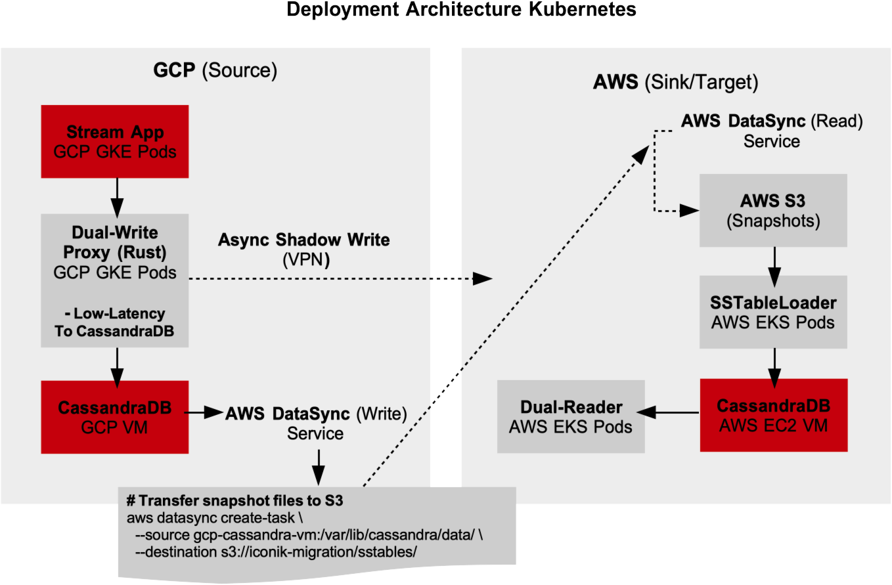

# ScyllaDB Cluster-to-Cluster Sync Service (Rust)
Ultra-Fast RPO/RTO Sensitive ScyllaDB (Cassandra DB Adaptive) Cluster to Cluster Tenant Data Synching Service in Rust using Shadow Write Transition Pattern.

The architecture of the ScyllaDB (or Cassandra DB source) to ScyllaDB (or Cassandra DB sink/target) involves three services to fulfill the tenant data lift-and-shift transition. These services are.

- **Dual-Writer Proxy Service** (Rust or C++20/23+) - Rust version used
- **SSTableLoader Processor Service** (Rust or C++20/23+) - Rust version used
- **Dual-Reader Data Sync Ack Service** (Rust or C++20/23+) - Rust version used

Rust or C++ is required to avoid any GC pauses that would fail 99999 SLA delivery as the data shuttling across the source to the target can NOT withstand latency delays.


## The Dual-Write Proxy Service Architecture

The following graphic shows the architectual workflow of the `Dual-Write Proxy` service deployed to Kubernetes.


The `Dual-Write` Pattern is executed as follows (high-level). See the following section `The Dual-Write Proxy Service Pattern (Low-Level)` for in-depth execution of the code.

```rust
async fn write_dual_async(&self, request: &WriteRequest) -> Result<WriteResponse, SyncError> {
    let query = QueryBuilder::build_insert_query(request);
    let start = Instant::now();
    
    // 1. SYNCHRONOUS write to source (PRIMARY) - This BLOCKS!
    self.source_conn.execute(&query, request.values.clone()).await?;
    let primary_latency = start.elapsed().as_secs_f64() * 1000.0;
    
    // 2. Check FilterGovernor before shadow write (tenant/table blacklist)
    let should_write_to_target = self.filter_governor.should_write_to_target(request).await;
    
    if !should_write_to_target {
        // Tenant/table is blacklisted - skip target write entirely
        info!(
            "Skipping target write for blacklisted request: {}.{}", 
            request.keyspace, request.table
        );
        
        let mut stats = self.stats.lock();
        stats.filtered_writes += 1;
        
        return Ok(WriteResponse {
            success: true,
            request_id: request.request_id,
            write_timestamp: request.timestamp.unwrap_or(0),
            latency_ms: primary_latency,
            error: None,
        });
    }
    
    // 3. ASYNCHRONOUS write to target (SHADOW) - Fire and forget!
    let target_conn = self.target_conn.clone();
    let request_clone = request.clone();
    let query_clone = query.clone();
    let failed_writes = self.failed_writes.clone();
    let config = self.config.read().await.clone();
    
    tokio::spawn(async move {  // <-- This spawns a separate task!
        let timeout = Duration::from_millis(config.writer.shadow_timeout_ms);
        let result = tokio::time::timeout(
            timeout,
            target_conn.execute(&query_clone, request_clone.values.clone())
        ).await;
        
        match result {
            Ok(Ok(_)) => {
                // Shadow write succeeded
                info!("Shadow write successful for request {}", request_clone.request_id);
            }
            Ok(Err(e)) => {
                // Shadow write failed - queue for retry, DON'T fail the request
                warn!("Shadow write failed for request {}: {:?}", request_clone.request_id, e);
                failed_writes.insert(
                    request_clone.request_id,
                    FailedWrite {
                        request: request_clone,
                        error: e.to_string(),
                        attempts: 1,
                        first_attempt: SystemTime::now(),
                    }
                );
            }
            Err(_) => {
                // Shadow write timed out - queue for retry
                warn!("Shadow write timed out for request {}", request_clone.request_id);
                failed_writes.insert(
                    request_clone.request_id,
                    FailedWrite {
                        request: request_clone.clone(),
                        error: "Timeout".to_string(),
                        attempts: 1,
                        first_attempt: SystemTime::now(),
                    }
                );
            }
        }
    });
    
    // 4. Return based on PRIMARY (source) result ONLY
    //    Success returned immediately after source write
    //    No wait for target - shadow write is fire-and-forget
    Ok(WriteResponse {
        success: true,
        request_id: request.request_id,
        write_timestamp: request.timestamp.unwrap_or(0),
        latency_ms: primary_latency,
        error: None,
    })
}
```

**The Dual-Write Flow Sequence**

The following graphic shows the `Dual-Writer-Proxy` receving the tenant data write request (to dispatch to the target ScyllaDB/CassandraDB Cluster instance) and how it returns thread control to the application calling on this service.


The critical part of the `Dual-Writer-Proxy` service is to understand the distinction of the `async` wait on the result from a sychrononous write to the source Cassandra (or even source ScyllaDB) and fire-and-forget asynchronous write to the shadow Cassandra DB or ScyllaDB sink/target database. The following codfe logic shows this workflow.


```rust
// SYNCHRONOUS (waits for result):
let cassandra_result = self.execute_cassandra_query(&query).await;
//                                                            
// This 'await': "Wait until Cassandra responds"
// The function PAUSES here untilthe result is retrieved

// ASYNCHRONOUS (fire-and-forget):
tokio::spawn(async move {
    Self::execute_scylla_query(&scylla, &query_clone).await;
});
// NO await on the spawn itself
// The function CONTINUES immediately without waiting
``` 


The `Dual-Writer-Proxy` service deploys a Kubernetes Pod co-resident to the GCP application (the streaming applicattion in the graphic) to avoid cross-cloud latency IF the Dual-Writer Proxy resided in the target cloud (AWS). The following Kubernetes `Deployment`resource shows this configuration relative to the streaming application. This shows the use of Cassandra DB as the source DB. This works identically for ScyllaDB.

```yaml
# rust-proxy-deployment.yaml - Deploys to GKE, NOT EKS 
apiVersion: apps/v1
kind: Deployment
metadata:
  name: rust-dual-writer-proxy
  namespace: engine-vector  # Same namespace as app in GKE
spec:
  replicas: 3
  selector:
    matchLabels:
      app: rust-proxy
  template:
    metadata:
      labels:
        app: rust-proxy
    spec:
      affinity:
        podAntiAffinity:  # Spread across nodes
          requiredDuringSchedulingIgnoredDuringExecution:
          - topologyKey: kubernetes.io/hostname
      containers:
      - name: proxy
        image: gcr.io/backlight-gcp/rust-proxy:v1  # GCR, not ECR!
        ports:
        - containerPort: 9042  # CQL port
        - containerPort: 8080  # Admin API
        env:
        - name: CASSANDRA_HOSTS
          value: "cassandra-0.cassandra-svc,cassandra-1.cassandra-svc"  # Local
        - name: SCYLLA_HOSTS
          value: "10.100.0.10,10.100.0.11,10.100.0.12"  # AWS IPs via VPN
        - name: WRITE_MODE
          value: "DualWriteAsync"
```

## The Dual-Write DB Duality of Functionality


The `dual-writer` design uses the `Factory Design Pattern` in crate `svckit/src/database/factory.rs` to instantiate the correct connection resource (Scylla to Scylla or Cassandra to Cassandra, or mixed-mode source of the DB and the target DB for the data migration). The ScyllaDB driver is 100% adaptable to Cassandra (to the latest Cassandra 4 driver). The client that requires a data migration of a ScyllaDB to ScyllaDB scenario will configure the values in the provided root directory `config/dual-writer-scylla.yaml` or `config/dual-writer-cassandra.yaml`, however these are templates and the actual configuration of each will go into a Kubernetes ConfigMap and have the ConfigMap referenced in the Kubernetes `Deployment` spec. No configuration logic for the dual-writer is hard-coded. 


## The Dual-Write Proxy Service Architecture (Alternate No-GKE, No-EKS)

The following graphic shows the architectual workflow of the `Dual-Write Proxy` service deployed directly to VMs (source VM on GCP and sink/target VM on AWS) without Kubernetes.




## The Dual-Write Proxy Service Pattern (Low-Level)


The non-multi crate pre-prod view of the code for the Dual-Write Proxy service (NOT using Envoy Proxy).

```rust
use axum::{
    extract::{Path, State},
    http::StatusCode,
    response::Json,
    routing::{get, post},
    Router,
};
use cassandra_cpp::{Cluster as CassandraCluster, Session as CassandraSession};
use futures::future::join_all;
use lazy_static::lazy_static;
use prometheus::{
    register_histogram_vec, register_int_counter_vec, HistogramVec, IntCounterVec,
};
use scylla::{Session as ScyllaSession, SessionBuilder};
use serde::{Deserialize, Serialize};
use std::{
    sync::Arc,
    time::{Duration, Instant},
};
use tokio::sync::RwLock;
use tower_http::trace::TraceLayer;
use tracing::{error, info, warn};

// Metrics for observability
lazy_static! {
    static ref WRITE_LATENCY: HistogramVec = register_histogram_vec!(
        "proxy_write_latency_seconds",
        "Write latency in seconds",
        &["database", "status"]
    )
    .unwrap();
    
    static ref WRITE_COUNTER: IntCounterVec = register_int_counter_vec!(
        "proxy_writes_total",
        "Total number of writes",
        &["database", "status"]
    )
    .unwrap();
    
    static ref CONSISTENCY_MISMATCHES: IntCounterVec = register_int_counter_vec!(
        "proxy_consistency_mismatches",
        "Number of consistency check failures",
        &["operation"]
    )
    .unwrap();
}

// Configuration for the proxy
#[derive(Clone, Debug, Deserialize)]
pub struct ProxyConfig {
    pub cassandra_hosts: Vec<String>,
    pub scylla_hosts: Vec<String>,
    pub write_mode: WriteMode,
    pub validation_percentage: f32, // 0.01 = 1% validation
    pub shadow_write_timeout_ms: u64,
    pub primary_write_timeout_ms: u64,
}

#[derive(Clone, Debug, Deserialize, PartialEq)]
pub enum WriteMode {
    PrimaryOnly,      // Phase 0: Only write to Cassandra
    DualWriteAsync,   // Phase 1: Write to both, don't wait for ScyllaDB
    DualWriteSync,    // Phase 2: Write to both, wait for both
    ShadowPrimary,    // Phase 3: ScyllaDB primary, Cassandra shadow
    TargetOnly,       // Phase 4: Only write to ScyllaDB (migration complete)
}

// Main proxy state
#[derive(Clone)]
pub struct MigrationProxy {
    cassandra: Arc<CassandraSession>,
    scylla: Arc<ScyllaSession>,
    config: Arc<RwLock<ProxyConfig>>,
    validator: Arc<ConsistencyValidator>,
}

impl MigrationProxy {
    pub async fn new(config: ProxyConfig) -> anyhow::Result<Self> {
        info!("Initializing Migration Proxy with config: {:?}", config);
        
        // Initialize Cassandra connection
        let mut cassandra_cluster = CassandraCluster::default();
        for host in &config.cassandra_hosts {
            cassandra_cluster.set_contact_points(host).unwrap();
        }
        cassandra_cluster.set_protocol_version(4).unwrap();
        let cassandra_session = cassandra_cluster.connect().unwrap();
        
        // Initialize ScyllaDB connection with native Rust driver
        let scylla_session = SessionBuilder::new()
            .known_nodes(&config.scylla_hosts)
            .connection_timeout(Duration::from_secs(10))
            .build()
            .await?;
        
        let validator = Arc::new(ConsistencyValidator::new());
        
        Ok(Self {
            cassandra: Arc::new(cassandra_session),
            scylla: Arc::new(scylla_session),
            config: Arc::new(RwLock::new(config)),
            validator,
        })
    }
    
    // Main write operation with dual-write logic
    pub async fn write(&self, request: WriteRequest) -> Result<WriteResponse, ProxyError> {
        let start = Instant::now();
        let config = self.config.read().await;
        
        match config.write_mode {
            WriteMode::PrimaryOnly => {
                self.write_cassandra_only(request).await
            }
            WriteMode::DualWriteAsync => {
                self.write_dual_async(request, &config).await
            }
            WriteMode::DualWriteSync => {
                self.write_dual_sync(request, &config).await
            }
            WriteMode::ShadowPrimary => {
                self.write_scylla_primary(request, &config).await
            }
            WriteMode::TargetOnly => {
                self.write_scylla_only(request).await
            }
        }
    }
    
    // Write only to Cassandra (Phase 0)
    async fn write_cassandra_only(&self, request: WriteRequest) -> Result<WriteResponse, ProxyError> {
        let timer = WRITE_LATENCY.with_label_values(&["cassandra", "success"]).start_timer();
        
        let query = self.build_cql_query(&request);
        // Execute on Cassandra
        match self.execute_cassandra_query(&query).await {
            Ok(_) => {
                timer.observe_duration();
                WRITE_COUNTER.with_label_values(&["cassandra", "success"]).inc();
                Ok(WriteResponse {
                    success: true,
                    latency_ms: timer.stop_and_record() * 1000.0,
                    database: "cassandra".to_string(),
                })
            }
            Err(e) => {
                WRITE_COUNTER.with_label_values(&["cassandra", "error"]).inc();
                Err(ProxyError::DatabaseError(e.to_string()))
            }
        }
    }
    
    // Dual write with async shadow write to ScyllaDB (Phase 1)
    async fn write_dual_async(
        &self,
        request: WriteRequest,
        config: &ProxyConfig,
    ) -> Result<WriteResponse, ProxyError> {
        let query = self.build_cql_query(&request);
        let timer = WRITE_LATENCY.with_label_values(&["cassandra", "primary"]).start_timer();
        
        // Write to primary (Cassandra) - this blocks
        let cassandra_result = self.execute_cassandra_query(&query).await;
        let primary_latency = timer.stop_and_record();
        
        // Clone for async ScyllaDB write
        let scylla = self.scylla.clone();
        let query_clone = query.clone();
        let timeout = config.shadow_write_timeout_ms;
        
        // Fire-and-forget write to ScyllaDB
        tokio::spawn(async move {
            let timer = WRITE_LATENCY.with_label_values(&["scylla", "shadow"]).start_timer();
            
            match tokio::time::timeout(
                Duration::from_millis(timeout),
                Self::execute_scylla_query(&scylla, &query_clone),
            )
            .await
            {
                Ok(Ok(_)) => {
                    timer.observe_duration();
                    WRITE_COUNTER.with_label_values(&["scylla", "shadow_success"]).inc();
                }
                Ok(Err(e)) => {
                    warn!("Shadow write to ScyllaDB failed: {}", e);
                    WRITE_COUNTER.with_label_values(&["scylla", "shadow_error"]).inc();
                }
                Err(_) => {
                    warn!("Shadow write to ScyllaDB timed out");
                    WRITE_COUNTER.with_label_values(&["scylla", "shadow_timeout"]).inc();
                }
            }
        });
        
        // Return based on primary result only
        match cassandra_result {
            Ok(_) => {
                WRITE_COUNTER.with_label_values(&["cassandra", "success"]).inc();
                
                // Randomly validate consistency
                if rand::random::<f32>() < config.validation_percentage {
                    self.validator.schedule_validation(request.clone()).await;
                }
                
                Ok(WriteResponse {
                    success: true,
                    latency_ms: primary_latency * 1000.0,
                    database: "cassandra_primary".to_string(),
                })
            }
            Err(e) => {
                WRITE_COUNTER.with_label_values(&["cassandra", "error"]).inc();
                Err(ProxyError::DatabaseError(e.to_string()))
            }
        }
    }
    
    // Dual write with synchronous writes to both (Phase 2)
    async fn write_dual_sync(
        &self,
        request: WriteRequest,
        config: &ProxyConfig,
    ) -> Result<WriteResponse, ProxyError> {
        let query = self.build_cql_query(&request);
        
        // Execute both writes in parallel
        let cassandra_future = self.execute_cassandra_query(&query);
        let scylla_future = Self::execute_scylla_query(&self.scylla, &query);
        
        let (cassandra_result, scylla_result) = tokio::join!(cassandra_future, scylla_future);
        
        // Both must succeed for the write to be considered successful
        match (cassandra_result, scylla_result) {
            (Ok(_), Ok(_)) => {
                WRITE_COUNTER.with_label_values(&["both", "success"]).inc();
                Ok(WriteResponse {
                    success: true,
                    latency_ms: 0.0, // Would track both latencies in production
                    database: "both".to_string(),
                })
            }
            (Err(e), _) | (_, Err(e)) => {
                WRITE_COUNTER.with_label_values(&["both", "error"]).inc();
                Err(ProxyError::DatabaseError(format!("Dual write failed: {}", e)))
            }
        }
    }
    
    // Write to ScyllaDB as primary (Phase 3)
    async fn write_scylla_primary(
        &self,
        request: WriteRequest,
        config: &ProxyConfig,
    ) -> Result<WriteResponse, ProxyError> {
        let query = self.build_cql_query(&request);
        let timer = WRITE_LATENCY.with_label_values(&["scylla", "primary"]).start_timer();
        
        // Write to primary (ScyllaDB) - this blocks
        let scylla_result = Self::execute_scylla_query(&self.scylla, &query).await;
        let primary_latency = timer.stop_and_record();
        
        // Shadow write to Cassandra (async, best-effort)
        let cassandra = self.cassandra.clone();
        let query_clone = query.clone();
        
        tokio::spawn(async move {
            let _ = Self::execute_cassandra_shadow(&cassandra, &query_clone).await;
        });
        
        match scylla_result {
            Ok(_) => {
                WRITE_COUNTER.with_label_values(&["scylla", "success"]).inc();
                Ok(WriteResponse {
                    success: true,
                    latency_ms: primary_latency * 1000.0,
                    database: "scylla_primary".to_string(),
                })
            }
            Err(e) => {
                WRITE_COUNTER.with_label_values(&["scylla", "error"]).inc();
                Err(ProxyError::DatabaseError(e.to_string()))
            }
        }
    }
    
    // Write only to ScyllaDB (Phase 4 - Migration Complete)
    async fn write_scylla_only(&self, request: WriteRequest) -> Result<WriteResponse, ProxyError> {
        let timer = WRITE_LATENCY.with_label_values(&["scylla", "success"]).start_timer();
        
        let query = self.build_cql_query(&request);
        match Self::execute_scylla_query(&self.scylla, &query).await {
            Ok(_) => {
                timer.observe_duration();
                WRITE_COUNTER.with_label_values(&["scylla", "success"]).inc();
                Ok(WriteResponse {
                    success: true,
                    latency_ms: timer.stop_and_record() * 1000.0,
                    database: "scylla".to_string(),
                })
            }
            Err(e) => {
                WRITE_COUNTER.with_label_values(&["scylla", "error"]).inc();
                Err(ProxyError::DatabaseError(e.to_string()))
            }
        }
    }
    
    // Build CQL query from request
    fn build_cql_query(&self, request: &WriteRequest) -> String {
        match &request.operation {
            Operation::Insert { table, data } => {
                format!(
                    "INSERT INTO {} ({}) VALUES ({}) IF NOT EXISTS",
                    table,
                    data.keys().cloned().collect::<Vec<_>>().join(", "),
                    data.values()
                        .map(|v| format!("'{}'", v))
                        .collect::<Vec<_>>()
                        .join(", ")
                )
            }
            Operation::Update { table, data, key } => {
                let set_clause = data
                    .iter()
                    .map(|(k, v)| format!("{} = '{}'", k, v))
                    .collect::<Vec<_>>()
                    .join(", ");
                format!("UPDATE {} SET {} WHERE {}", table, set_clause, key)
            }
            Operation::Delete { table, key } => {
                format!("DELETE FROM {} WHERE {}", table, key)
            }
        }
    }
    
    // Execute query on Cassandra
    async fn execute_cassandra_query(&self, query: &str) -> anyhow::Result<()> {
        // Cassandra execution logic
        // In production, this would use the cassandra-cpp async API
        Ok(())
    }
    
    async fn execute_cassandra_shadow(session: &CassandraSession, query: &str) -> anyhow::Result<()> {
        // Shadow write to Cassandra - best effort, no error propagation
        Ok(())
    }
    
    // Execute query on ScyllaDB
    async fn execute_scylla_query(session: &ScyllaSession, query: &str) -> anyhow::Result<()> {
        session.query(query, &[]).await?;
        Ok(())
    }
    
    // Update configuration on the fly (no restart needed!)
    pub async fn update_config(&self, new_config: ProxyConfig) {
        info!("Updating proxy configuration to: {:?}", new_config);
        let mut config = self.config.write().await;
        *config = new_config;
    }
    
    // Health check endpoint
    pub async fn health_check(&self) -> HealthStatus {
        let config = self.config.read().await;
        HealthStatus {
            cassandra_connected: self.check_cassandra_health().await,
            scylla_connected: self.check_scylla_health().await,
            current_mode: format!("{:?}", config.write_mode),
            validation_rate: config.validation_percentage,
        }
    }
    
    async fn check_cassandra_health(&self) -> bool {
        // Check Cassandra connection health
        true // Simplified for demo
    }
    
    async fn check_scylla_health(&self) -> bool {
        // Check ScyllaDB connection health  
        match self.scylla.query("SELECT now() FROM system.local", &[]).await {
            Ok(_) => true,
            Err(_) => false,
        }
    }
}

// Consistency Validator runs in background
pub struct ConsistencyValidator {
    pending_validations: Arc<RwLock<Vec<WriteRequest>>>,
}

impl ConsistencyValidator {
    pub fn new() -> Self {
        Self {
            pending_validations: Arc::new(RwLock::new(Vec::new())),
        }
    }
    
    pub async fn schedule_validation(&self, request: WriteRequest) {
        let mut pending = self.pending_validations.write().await;
        pending.push(request);
    }
    
    pub async fn run_validation_loop(
        &self,
        cassandra: Arc<CassandraSession>,
        scylla: Arc<ScyllaSession>,
    ) {
        loop {
            tokio::time::sleep(Duration::from_secs(10)).await;
            
            let mut pending = self.pending_validations.write().await;
            if pending.is_empty() {
                continue;
            }
            
            let to_validate = pending.drain(..).collect::<Vec<_>>();
            drop(pending); // Release lock
            
            for request in to_validate {
                // Compare data between Cassandra and ScyllaDB
                match self.validate_consistency(&request, &cassandra, &scylla).await {
                    Ok(true) => {
                        info!("Consistency check passed for {:?}", request);
                    }
                    Ok(false) => {
                        warn!("Consistency mismatch detected for {:?}", request);
                        CONSISTENCY_MISMATCHES.with_label_values(&["data_mismatch"]).inc();
                    }
                    Err(e) => {
                        error!("Consistency check failed: {}", e);
                        CONSISTENCY_MISMATCHES.with_label_values(&["check_error"]).inc();
                    }
                }
            }
        }
    }
    
    async fn validate_consistency(
        &self,
        request: &WriteRequest,
        cassandra: &CassandraSession,
        scylla: &ScyllaSession,
    ) -> anyhow::Result<bool> {
        // Read from both databases and compare
        // This is trivialized - actual production code in Git would handle all data types
        Ok(true)
    }
}

// Request/Response types
#[derive(Clone, Debug, Serialize, Deserialize)]
pub struct WriteRequest {
    pub operation: Operation,
    pub consistency: Option<String>,
    pub timeout_ms: Option<u64>,
}

#[derive(Clone, Debug, Serialize, Deserialize)]
pub enum Operation {
    Insert {
        table: String,
        data: std::collections::HashMap<String, String>,
    },
    Update {
        table: String,
        data: std::collections::HashMap<String, String>,
        key: String,
    },
    Delete {
        table: String,
        key: String,
    },
}

#[derive(Debug, Serialize)]
pub struct WriteResponse {
    pub success: bool,
    pub latency_ms: f64,
    pub database: String,
}

#[derive(Debug, Serialize)]
pub struct HealthStatus {
    pub cassandra_connected: bool,
    pub scylla_connected: bool,
    pub current_mode: String,
    pub validation_rate: f32,
}

#[derive(Debug)]
pub enum ProxyError {
    DatabaseError(String),
    ValidationError(String),
    ConfigError(String),
}

impl From<ProxyError> for StatusCode {
    fn from(err: ProxyError) -> Self {
        match err {
            ProxyError::DatabaseError(_) => StatusCode::SERVICE_UNAVAILABLE,
            ProxyError::ValidationError(_) => StatusCode::CONFLICT,
            ProxyError::ConfigError(_) => StatusCode::BAD_REQUEST,
        }
    }
}

// HTTP Server setup
pub async fn create_app(proxy: MigrationProxy) -> Router {
    Router::new()
        .route("/write", post(handle_write))
        .route("/health", get(handle_health))
        .route("/config", post(handle_config_update))
        .route("/metrics", get(handle_metrics))
        .layer(TraceLayer::new_for_http())
        .with_state(proxy)
}

async fn handle_write(
    State(proxy): State<MigrationProxy>,
    Json(request): Json<WriteRequest>,
) -> Result<Json<WriteResponse>, StatusCode> {
    match proxy.write(request).await {
        Ok(response) => Ok(Json(response)),
        Err(e) => Err(e.into()),
    }
}

async fn handle_health(State(proxy): State<MigrationProxy>) -> Json<HealthStatus> {
    Json(proxy.health_check().await)
}

async fn handle_config_update(
    State(proxy): State<MigrationProxy>,
    Json(config): Json<ProxyConfig>,
) -> StatusCode {
    proxy.update_config(config).await;
    StatusCode::OK
}

async fn handle_metrics() -> String {
    // Return Prometheus metrics
    prometheus::TextEncoder::new()
        .encode_to_string(&prometheus::gather())
        .unwrap()
}

#[tokio::main]
async fn main() -> anyhow::Result<()> {
    // Initialize tracing
    tracing_subscriber::fmt::init();
    
    // Load configuration
    let config = ProxyConfig {
        cassandra_hosts: vec!["cassandra-1.gcp.enginevector.io".to_string()],
        scylla_hosts: vec!["scylla-1.aws.enginevector.io".to_string()],
        write_mode: WriteMode::DualWriteAsync,
        validation_percentage: 0.01, // 1% validation
        shadow_write_timeout_ms: 100,
        primary_write_timeout_ms: 1000,
    };
    
    // Create proxy
    let proxy = MigrationProxy::new(config).await?;
    
    // Start validation loop in background
    let validator = proxy.validator.clone();
    let cassandra = proxy.cassandra.clone();
    let scylla = proxy.scylla.clone();
    tokio::spawn(async move {
        validator.run_validation_loop(cassandra, scylla).await;
    });
    
    // Create and run HTTP server
    let app = create_app(proxy).await;
    
    info!("Starting Migration Proxy on port 8080");
    let listener = tokio::net::TcpListener::bind("0.0.0.0:8080").await?;
    axum::serve(listener, app).await?;
    
    Ok(())
}
```

## The Four Stages of the Dual-Write Proxy Service (To Full Data Transition End)

```shell
Phase 1 - DualWriteAsync (Current):
  Cassandra: SYNCHRONOUS (primary) ✓
  ScyllaDB:  ASYNCHRONOUS (shadow) 
  App Impact: NONE (still <1ms latency)

Phase 2 - DualWriteSync (Validation):
  Cassandra: SYNCHRONOUS (primary) ✓
  ScyllaDB:  SYNCHRONOUS (also waits) ✓
  App Impact: Slight increase in latency
  Purpose: Ensure ScyllaDB can handle load

Phase 3 - ShadowPrimary (Flip):
  Cassandra: ASYNCHRONOUS (shadow)
  ScyllaDB:  SYNCHRONOUS (primary) ✓
  App Impact: Now using ScyllaDB's performance!

Phase 4 - TargetOnly (Complete):
  Cassandra: NONE (decommissioned)
  ScyllaDB:  SYNCHRONOUS (only database) ✓
  App Impact: Full ScyllaDB benefits
```


## Dual-Writer CQL Proxy Two Separate Layers**
```
┌─────────────────────────────────────────────┐
│ LAYER 1: App → Proxy                       │
│ Protocol: CQL Binary v4                     │
│ Parsed by: cassandra-protocol crate        │
└─────────────────────────────────────────────┘
              ↓
┌─────────────────────────────────────────────┐
│ LAYER 2: Proxy → Database                   │
│ Protocol: CQL Binary v4 (same!)             │
│ Generated by: scylla crate                  │
│ Works with: Cassandra 4.x AND ScyllaDB      │
└─────────────────────────────────────────────┘
```


### Testing the CQL Proxy Layer (Python Client)

```python
#!/usr/bin/env python3
"""
Test client for CQL dual-writer proxy
Shows that Python cassandra-driver works transparently
"""

from cassandra.cluster import Cluster
from cassandra.auth import PlainTextAuthProvider
import uuid
import time

def test_cql_proxy():
    """Test CQL proxy with Python cassandra-driver"""
    
    print("Connecting to CQL dual-writer proxy...")
    
    # Connect to dual-writer proxy (NOT directly to Cassandra!)
    cluster = Cluster(
        contact_points=['127.0.0.1'],
        port=9042,  # CQL proxy port
        protocol_version=4
    )
    
    session = cluster.connect()
    print("Connected to CQL proxy")
    
    # Set keyspace
    session.set_keyspace('files_keyspace')
    print("Keyspace set to files_keyspace")
    
    # Test INSERT
    file_id = uuid.uuid4()
    tenant_id = uuid.uuid4()
    
    query = """
    INSERT INTO files (system_domain_id, id, name, size, status)
    VALUES (?, ?, ?, ?, ?)
    """
    
    print(f"\nInserting test file: {file_id}")
    session.execute(query, [tenant_id, file_id, "test.jpg", 1024, "CLOSED"])
    print("INSERT successful - dual-written to GCP + AWS!")
    
    # Test SELECT
    query = "SELECT * FROM files WHERE system_domain_id = ? AND id = ?"
    print(f"\nQuerying file: {file_id}")
    rows = session.execute(query, [tenant_id, file_id])
    
    for row in rows:
        print(f"Found: {row.name} ({row.size} bytes, status={row.status})")
    
    # Test UPDATE
    query = """
    UPDATE files SET status = ? WHERE system_domain_id = ? AND id = ?
    """
    print(f"\nUpdating file status...")
    session.execute(query, ["ARCHIVED", tenant_id, file_id])
    print("UPDATE successful - dual-written to both clusters!")
    
    # Test blacklist (optional - requires tenant in blacklist)
    blacklisted_tenant = uuid.UUID("e19206ba-c584-11e8-882a-0a580a30028e")
    query = """
    INSERT INTO files (system_domain_id, id, name, size, status)
    VALUES (?, ?, ?, ?, ?)
    """
    print(f"\nTesting blacklist with tenant: {blacklisted_tenant}")
    session.execute(query, [blacklisted_tenant, uuid.uuid4(), "blocked.jpg", 2048, "CLOSED"])
    print("Request accepted (written to GCP only, AWS skipped)")
    
    cluster.shutdown()
    print("\nAll tests passed!")
    print("CQL proxy working transparently with Python cassandra-driver!")

if __name__ == "__main__":
    try:
        test_cql_proxy()
    except Exception as e:
        print(f"Test failed: {e}")
        import traceback
        traceback.print_exc()
```


## Client Applications Use of Dual-Write Proxy Service

```python
"""
Python client for the Rust-based Migration Proxy
"""

import asyncio
import json
import time
from dataclasses import dataclass, asdict
from enum import Enum
from typing import Dict, Optional, Any, List
import aiohttp
import logging
from datetime import datetime
import uuid

# Configure logging
logging.basicConfig(level=logging.INFO)
logger = logging.getLogger(__name__)


class WriteMode(Enum):
    """Migration phases - matches Rust enum exactly"""
    SOURCE_ONLY = "SourceOnly"      # Phase 0: Source (GCP/Cassandra) only
    DUAL_ASYNC = "DualAsync"        # Phase 1: Shadow writes (async to target)
    DUAL_SYNC = "DualSync"          # Phase 2: Synchronous dual writes
    TARGET_ONLY = "TargetOnly"      # Phase 3: Target (AWS/ScyllaDB) only


class ConsistencyLevel(Enum):
    """CQL consistency levels - matches Rust enum"""
    ANY = "Any"
    ONE = "One"
    TWO = "Two"
    THREE = "Three"
    QUORUM = "Quorum"
    ALL = "All"
    LOCAL_QUORUM = "LocalQuorum"
    EACH_QUORUM = "EachQuorum"
    LOCAL_ONE = "LocalOne"


@dataclass
class ClusterConfig:
    """Database cluster configuration - matches Rust ClusterConfig"""
    driver: str  # "scylla" or "cassandra"
    hosts: List[str]
    port: int
    keyspace: str
    username: Optional[str] = None
    password: Optional[str] = None
    connection_timeout_secs: int = 5
    request_timeout_secs: int = 10
    pool_size: int = 4


@dataclass
class WriterConfig:
    """Writer behavior configuration - matches Rust WriterConfig"""
    mode: WriteMode
    shadow_timeout_ms: int = 5000
    retry_interval_secs: int = 60
    max_retry_attempts: int = 3
    batch_size: int = 100


@dataclass
class DualWriterConfig:
    """Full configuration - matches Rust DualWriterConfig"""
    source: ClusterConfig
    target: ClusterConfig
    writer: WriterConfig


@dataclass 
class WriteRequest:
    """Write request - matches Rust WriteRequest in svckit/types.rs"""
    keyspace: str
    table: str
    query: str
    values: List[Any]
    consistency: Optional[ConsistencyLevel] = None
    request_id: Optional[str] = None
    timestamp: Optional[int] = None
    
    def __post_init__(self):
        if self.request_id is None:
            self.request_id = str(uuid.uuid4())


@dataclass
class WriteResponse:
    """Write response - matches Rust WriteResponse"""
    success: bool
    request_id: str
    write_timestamp: int
    latency_ms: float
    error: Optional[str] = None


class MigrationProxyClient:
    """
    Python client for the Rust migration proxy.
    This shows that ANY application language can use our proxy.
    """
    
    def __init__(self, proxy_url: str = "http://localhost:8080"):
        self.proxy_url = proxy_url
        self.session = None
        self._metrics = {
            "writes": 0,
            "errors": 0,
            "total_latency_ms": 0
        }
    
    async def __aenter__(self):
        """Async context manager entry"""
        self.session = aiohttp.ClientSession()
        await self.health_check()
        return self
    
    async def __aexit__(self, exc_type, exc_val, exc_tb):
        """Async context manager exit"""
        if self.session:
            await self.session.close()
    
    async def health_check(self) -> Dict[str, Any]:
        """Check proxy health and connectivity"""
        async with self.session.get(f"{self.proxy_url}/health") as response:
            health = await response.json()
            logger.info(f"Proxy Health: {health}")
            return health
    
    async def get_status(self) -> Dict[str, Any]:
        """Get current proxy status and stats"""
        async with self.session.get(f"{self.proxy_url}/status") as response:
            return await response.json()
    
    async def insert(self, 
                    keyspace: str,
                    table: str, 
                    data: Dict[str, Any],
                    consistency: Optional[ConsistencyLevel] = None) -> WriteResponse:
        """
        Insert data through the proxy
        
        Use Case Call:
            await client.insert(
                keyspace="iconik_production",
                table="media_assets",
                data={
                    "asset_id": "uuid-12345",
                    "title": "Corporate Video Q4",
                    "duration": 1800,
                    "codec": "h264"
                }
            )
        """
        # Build CQL INSERT query
        columns = list(data.keys())
        placeholders = ", ".join(["?" for _ in columns])
        query = f"INSERT INTO {keyspace}.{table} ({', '.join(columns)}) VALUES ({placeholders})"
        
        request = WriteRequest(
            keyspace=keyspace,
            table=table,
            query=query,
            values=list(data.values()),
            consistency=consistency
        )
        
        return await self._execute_write(request)
    
    async def update(self,
                    keyspace: str,
                    table: str,
                    data: Dict[str, Any],
                    where_clause: str,
                    where_values: List[Any],
                    consistency: Optional[ConsistencyLevel] = None) -> WriteResponse:
        """
        Update data through the proxy
        
        Use Case Call:
            await client.update(
                keyspace="iconik_production",
                table="media_assets",
                data={"status": "processed", "updated_at": datetime.now().isoformat()},
                where_clause="asset_id = ?",
                where_values=["uuid-12345"]
            )
        """
        # Build CQL UPDATE query
        set_clause = ", ".join([f"{k} = ?" for k in data.keys()])
        query = f"UPDATE {keyspace}.{table} SET {set_clause} WHERE {where_clause}"
        values = list(data.values()) + where_values
        
        request = WriteRequest(
            keyspace=keyspace,
            table=table,
            query=query,
            values=values,
            consistency=consistency
        )
        
        return await self._execute_write(request)
    
    async def delete(self,
                    keyspace: str,
                    table: str,
                    where_clause: str,
                    where_values: List[Any],
                    consistency: Optional[ConsistencyLevel] = None) -> WriteResponse:
        """
        Delete data through the proxy
        
        Use Case Call:
            await client.delete(
                keyspace="iconik_production",
                table="media_assets",
                where_clause="asset_id = ?",
                where_values=["uuid-12345"]
            )
        """
        query = f"DELETE FROM {keyspace}.{table} WHERE {where_clause}"
        
        request = WriteRequest(
            keyspace=keyspace,
            table=table,
            query=query,
            values=where_values,
            consistency=consistency
        )
        
        return await self._execute_write(request)
    
    async def _execute_write(self, request: WriteRequest) -> WriteResponse:
        """Execute write operation through the proxy"""
        start_time = time.time()
        
        payload = {
            "keyspace": request.keyspace,
            "table": request.table,
            "query": request.query,
            "values": request.values,
            "request_id": request.request_id,
            "timestamp": request.timestamp
        }
        
        if request.consistency:
            payload["consistency"] = request.consistency.value
        
        try:
            async with self.session.post(
                f"{self.proxy_url}/write",
                json=payload,
                headers={"Content-Type": "application/json"}
            ) as response:
                result = await response.json()
                
                # Track metrics
                self._metrics["writes"] += 1
                latency = (time.time() - start_time) * 1000
                self._metrics["total_latency_ms"] += latency
                
                if response.status == 200 and result.get("success", False):
                    logger.debug(f"Write successful: {result}")
                    return WriteResponse(
                        success=result["success"],
                        request_id=result["request_id"],
                        write_timestamp=result["write_timestamp"],
                        latency_ms=result["latency_ms"],
                        error=result.get("error")
                    )
                else:
                    self._metrics["errors"] += 1
                    logger.error(f"Write failed with status {response.status}: {result}")
                    raise Exception(f"Write failed: {result}")
                    
        except Exception as e:
            self._metrics["errors"] += 1
            logger.error(f"Write operation failed: {e}")
            raise
    
    async def update_write_mode(self, mode: WriteMode) -> bool:
        """
        Update the write mode without restart
        This is how we progress through migration phases!
        """
        async with self.session.post(
            f"{self.proxy_url}/config/mode",
            json={"mode": mode.value}
        ) as response:
            if response.status == 200:
                logger.info(f"Successfully updated proxy to {mode.value} mode")
                return True
            else:
                logger.error(f"Failed to update write mode: {response.status}")
                return False
    
    async def get_metrics(self) -> Dict[str, Any]:
        """Get Prometheus metrics from the proxy"""
        async with self.session.get(f"{self.proxy_url}/metrics") as response:
            metrics_text = await response.text()
            return self._parse_prometheus_metrics(metrics_text)
    
    async def get_stats(self) -> Dict[str, Any]:
        """Get writer statistics"""
        async with self.session.get(f"{self.proxy_url}/stats") as response:
            return await response.json()
    
    def _parse_prometheus_metrics(self, metrics_text: str) -> Dict[str, Any]:
        """Parse Prometheus text format into dict"""
        metrics = {}
        for line in metrics_text.split('\n'):
            if line and not line.startswith('#'):
                parts = line.split(' ')
                if len(parts) == 2:
                    metric_name = parts[0].split('{')[0]
                    metric_value = float(parts[1])
                    metrics[metric_name] = metric_value
        return metrics
    
    def get_client_metrics(self) -> Dict[str, Any]:
        """Get client-side metrics"""
        avg_latency = 0
        if self._metrics["writes"] > 0:
            avg_latency = self._metrics["total_latency_ms"] / self._metrics["writes"]
        
        return {
            "total_writes": self._metrics["writes"],
            "total_errors": self._metrics["errors"],
            "average_latency_ms": avg_latency,
            "error_rate": self._metrics["errors"] / max(1, self._metrics["writes"])
        }


class MigrationOrchestrator:
    """
    Orchestrates the migration through different phases
    This would run as a separate control plane service
    """
    
    def __init__(self, proxy_client: MigrationProxyClient):
        self.proxy_client = proxy_client
        self.current_phase = WriteMode.SOURCE_ONLY
        
    async def start_shadow_writes(self):
        """Phase 1: Begin shadow writes to target (ScyllaDB/AWS)"""
        logger.info("Starting Phase 1: Shadow Writes (DualAsync)")
        
        success = await self.proxy_client.update_write_mode(WriteMode.DUAL_ASYNC)
        if success:
            self.current_phase = WriteMode.DUAL_ASYNC
            logger.info("Shadow writes enabled - writes go to source sync, target async")
        return success
    
    async def enable_sync_writes(self):
        """Phase 2: Enable synchronous dual writes"""
        logger.info("Starting Phase 2: Synchronous Dual Writes (DualSync)")
        
        success = await self.proxy_client.update_write_mode(WriteMode.DUAL_SYNC)
        if success:
            self.current_phase = WriteMode.DUAL_SYNC
            logger.info("Synchronous dual writes enabled - both clusters must succeed")
        return success
    
    async def complete_migration(self):
        """Phase 3: Complete migration to target only"""
        logger.info("Starting Phase 3: Target Only (TargetOnly)")
        
        success = await self.proxy_client.update_write_mode(WriteMode.TARGET_ONLY)
        if success:
            self.current_phase = WriteMode.TARGET_ONLY
            logger.info("Migration complete! Running on target (ScyllaDB/AWS) only")
        return success
    
    async def rollback_to_source(self):
        """Emergency rollback to source only"""
        logger.warning("ROLLBACK: Reverting to Source Only mode")
        
        success = await self.proxy_client.update_write_mode(WriteMode.SOURCE_ONLY)
        if success:
            self.current_phase = WriteMode.SOURCE_ONLY
            logger.info("Rollback complete - running on source only")
        return success
    
    async def monitor_migration(self, duration_seconds: int = 60):
        """Monitor migration metrics"""
        logger.info(f"Monitoring migration for {duration_seconds} seconds...")
        
        start_time = time.time()
        while time.time() - start_time < duration_seconds:
            try:
                stats = await self.proxy_client.get_stats()
                client_metrics = self.proxy_client.get_client_metrics()
                
                logger.info(f"""
                Migration Metrics:
                - Phase: {self.current_phase.value}
                - Total writes: {stats.get('total_writes', 0)}
                - Successful: {stats.get('successful_writes', 0)}
                - Failed: {stats.get('failed_writes', 0)}
                - Filtered: {stats.get('filtered_writes', 0)}
                - Client avg latency: {client_metrics['average_latency_ms']:.2f}ms
                """)
            except Exception as e:
                logger.error(f"Failed to get metrics: {e}")
            
            await asyncio.sleep(10)


# Showing how third-party media application would integrate
async def iconik_media_application_svc():
    """
    How Iconik's application would use the proxy
    The application code changes minimally - just the connection endpoint
    """
    
    # Instead of connecting directly to Cassandra, connect to the proxy
    async with MigrationProxyClient("http://dual-writer:8080") as client:
        
        # Normal application operations - minimal code changes!
        
        # Insert a new media asset
        await client.insert(
            keyspace="iconik_production",
            table="media_assets",
            data={
                "asset_id": "550e8400-e29b-41d4-a716-446655440000",
                "title": "Q4 2024 Earnings Call",
                "file_path": "s3://media-bucket/earnings/q4-2024.mp4",
                "duration": 3600,
                "codec": "h264",
                "bitrate": 5000000,
                "resolution": "1920x1080",
                "created_at": datetime.now().isoformat()
            }
        )
        
        # Update asset status after processing
        await client.update(
            keyspace="iconik_production",
            table="media_assets",
            data={
                "status": "transcoded",
                "thumbnail_path": "s3://media-bucket/thumbnails/q4-2024.jpg",
                "updated_at": datetime.now().isoformat()
            },
            where_clause="asset_id = ?",
            where_values=["550e8400-e29b-41d4-a716-446655440000"]
        )
        
        # Bulk insert for batch operations
        for i in range(100):
            await client.insert(
                keyspace="iconik_production",
                table="media_chunks",
                data={
                    "chunk_id": f"chunk-{i}",
                    "asset_id": "550e8400-e29b-41d4-a716-446655440000",
                    "sequence": i,
                    "size": 1048576  # 1MB chunks
                }
            )
        
        # Get metrics to monitor performance
        metrics = client.get_client_metrics()
        logger.info(f"Application metrics: {metrics}")


async def migration_control_plane_svc():
    """
    How the migration would be orchestrated
    This would be a separate control plane service
    """
    
    async with MigrationProxyClient("http://dual-writer:8080") as client:
        orchestrator = MigrationOrchestrator(client)
        
        # Check initial health
        health = await client.health_check()
        logger.info(f"Initial proxy health: {health}")
        
        # Get current stats
        stats = await client.get_stats()
        logger.info(f"Current stats: {stats}")
        
        # Phase 1: Start shadow writes
        await orchestrator.start_shadow_writes()
        await orchestrator.monitor_migration(30)
        
        # Phase 2: Synchronous writes (if metrics look good)
        await orchestrator.enable_sync_writes()
        await orchestrator.monitor_migration(30)
        
        # Phase 3: Complete migration (cutover to target)
        await orchestrator.complete_migration()
        await orchestrator.monitor_migration(30)
        
        logger.info("Migration completed successfully!")


if __name__ == "__main__":
    # Run the application
    asyncio.run(iconik_media_application_svc())
    
    # Uncomment to run migration orchestration
    # asyncio.run(migration_control_plane_svc())
```


## The SSTableLoader Bulk Transfer Processor

The deployment location of this service is on the target cloud side. If the DB clusters involved are Cassandra or ScyllaDB on GCP (GKE, GCP Compute Instance VM) on source side and the target Cassandra DB or ScyllaDB Cluster is on AWS (EKS or EC2, Firecracker), the `sstable-loader` service will require is location on the AWS target side. 

The SSTableLoader requires its location on the **target** side. 


### The Advantages of Target Side Locationing

- **Network Locality** Loads data directly into AWS Cassandra or SycllaDB cluster
- **Network Throughput** No Cross-Cloud data transfer during bulk load
- **Cost** Avoids GCP egress charges for bulk data
- **Performance** Local disk I/O on AWS EC2


## The Dual-Reader Service

The deployment location of this service is **NOT** strictly enforced on source or target side. 
It is advised that this service location execute on the **target** side of the transfer to avoid costly egress costs from the source cloud side (if GCP to AWS), the `dual-reader` service is at its advantage if it is deployed on the AWS side (EKS, EC2, Firecracker).


### The Advantages of Target Side Locationing

- **Network Symmetry** If on AWS, 1 read is local, 1 is remote (vs 2 remote if on GCP)
- **Cost** Avoid GCP egress for validation reads
- **After Cutover** Dual Reader validator stays on AWS to focus AWS target on Cassandra DB


The following architectural workflow graphic shows the entire fleet of the `scylla/cassandra-cluster-sync` application of the dual-writer proxy service, sstable-loader service and dual-writer service (dual-cluster checksumming validation). This version of the entire architectural workflow shows a **Kubernetes-Native** deployment. The graphic shows CasssandraDB instance, however this 100% adapts to ScyllaDB cluster without disruptive change.




The following architectural workflow graphic shows the entire fleet of the `scylla/cassandra-cluster-sync` application of the dual-writer proxy service, sstable-loader service and dual-writer service. This version of the entire architectural workflow shows a **Cloud-Native** VM deployment (services a Docker containers on GCP Compute Instance VMs and AWS EC2 VMs). The graphic shows CasssandraDB instance, however this 100% adapts to ScyllaDB cluster without disruptive change.


## Index Management (SSTableLoader Process Server)

### With Secondary Indexes (recommended for 60+ indexes):
```bash
./sstable-loader --config config/sstable-loader.yaml \
                 --indexes config/indexes.yaml \
                 --auto-start
```

### Without Secondary Indexes:
```bash
./sstable-loader --config config/sstable-loader.yaml \
                 --skip-indexes \
                 --auto-start
```

### Empty indexes.yaml (also valid):
```yaml
# indexes.yaml - no indexes to manage
[]
```


## CassandraDB vs ScyllaDB Kubernetes Operator Cost Reduction

The high-cognitive load of configuration and JVM overhead using the Cassandra DB and its deployment using the Cassandra DB Kubernetes Operator.

```shell
# cassandra-dc1.yaml
apiVersion: cassandra.datastax.com/v1beta1
kind: CassandraDatacenter
metadata:
  name: dc1
spec:
  clusterName: enginevector-cluster
  serverVersion: "4.0.7"
  size: 12  # Requires 4x nodes vs ScyllaDB (3)
  config:
    jvm-options:
      initial_heap_size: "8G"
      max_heap_size: "8G"
      # GC Tuning cognitive-overload
      additional-jvm-opts:
        - "-XX:+UseG1GC"
        - "-XX:G1RSetUpdatingPauseTimePercent=5"
        - "-XX:MaxGCPauseMillis=300"
        # ... 20 more GC flags
```

The low-cognitive load of configuration and no-JVM overhead using the Scylla DB (uses 100% C++) and its deployment using the ScyllaDB Kubernetes Operator.

```shell
# scylla-cluster.yaml - Self-tuning (automatic):
apiVersion: scylla.scylladb.com/v1
kind: ScyllaCluster
metadata:
  name: enginevector-cluster
spec:
  version: 5.2.0
  developerMode: false  # Production mode = auto-tuning!
  cpuset: true  # CPU pinning for zero latency
  size: 3  # 3 nodes instead of 12
  resources:
    requests:
      cpu: 7  # Leaves 1 CPU for system
      memory: 30Gi  # No heap sizing
```

The applications using CassandraDB and to the switch to SycllaDB provides 100% transparent functionality with no code changes.

```rust
//Existing Cassandra DB code:
let cluster = Cluster::new(vec!["cassandra-node1", "cassandra-node2"]);
let session = cluster.connect("engine-vector");

// ScyllaDB (identical)
let cluster = Cluster::new(vec!["scylla-node1", "scylla-node2"]);
let session = cluster.connect("engine-vector");
```


# Changes with ScyllaDB Operator on EKS

```shell
Cassandra on EKS:
- Memory: 32GB (8GB heap + 24GB off-heap)
- GC Pauses: 200-800ms (G1GC)
- Nodes needed: 12 for your workload
- Annual EC2 cost: ~$105,000 (m5.2xlarge)

ScyllaDB on EKS:  
- Memory: 32GB (ALL used efficiently, no JVM)
- GC Pauses: ZERO (C++ memory management)
- Nodes needed: 3-4 for same workload
- Annual EC2 cost: ~$35,000 (i3.2xlarge with NVMe)
- TCO Savings: ~70% ($70,000/year!)
```


## Project Structure

```shell
scylla-cluster-sync-rs
├── Cargo.lock
├── Cargo.toml
├── LICENSE
├── Makefile
├── README-DW-SSTLoader-Processor-DR.md
├── README.md
├── config
│   ├── dual-reader.yaml
│   ├── dual-writer-cassandra.yaml
│   ├── dual-writer-scylla.yaml
│   ├── filter-rules,yaml
│   ├── indexes.yaml
│   └── sstable-loader.yaml
├── docker-compose.yaml
├── docs
├── monitoring
│   ├── grafana
│   │   └── provisioning
│   │       └── datasources
│   │           └── prometheus.yaml
│   └── prometheus.yaml
├── services
│   ├── dual-reader
│   │   ├── Cargo.toml
│   │   ├── Dockerfile.dual-reader
│   │   ├── Makefile
│   │   └── src
│   │       ├── api.rs
│   │       ├── config.rs
│   │       ├── main.rs
│   │       ├── reader.rs
│   │       ├── reconciliation.rs
│   │       └── validator.rs
│   ├── dual-writer
│   │   ├── Cargo.toml
│   │   ├── Dockerfile.dual-writer
│   │   ├── Makefile
│   │   └── src
│   │       ├── api.rs
│   │       ├── config.rs
│   │       ├── filter.rs
│   │       ├── health.rs
│   │       ├── main.rs
│   │       └── writer.rs
│   └── sstable-loader
│       ├── Cargo.toml
│       ├── Dockerfile.sstable-loader
│       ├── Makefile
│       └── src
│           ├── api.rs
│           ├── config.rs
│           ├── index_manager.rs
│           ├── loader.rs
│           ├── main.rs
│           └── token_range.rs
└── svckit
    ├── Cargo.toml
    └── src
        ├── config.rs
        ├── database
        │   ├── cassandra.rs
        │   ├── factory.rs
        │   ├── mod.rs
        │   ├── query_builder.rs
        │   ├── retry.rs
        │   └── scylla.rs
        ├── errors.rs
        ├── lib.rs
        ├── metrics.rs
        └── types.rs
```


## Compiling the Services

```shell
# From repository root
cd scylla-cluster-sync-rs

# Check workspace structure
cargo check --workspace

# Build all services
cargo build --workspace

# Build individual services
cargo build --bin dual-writer
cargo build --bin dual-reader
cargo build --bin sstable-loader
```

**Or** with the provided root Makefile.
```
# =============================================================================
# Building Scylla Cluster Sync Services
# =============================================================================

# --- Native Rust Builds ---

# Build all services (debug mode - faster compilation)
make build

# Build all services (release mode - optimized binaries)
make build-release

# Build individual services (release mode)
make dual-writer
make dual-reader
make sstable-loader

# Alternative: using cargo directly
cargo build --workspace                    # debug
cargo build --workspace --release          # release
cargo build --release --bin dual-writer    # single service

# --- Docker Builds ---

# Build all Docker images
make docker-build

# Build individual Docker images
make docker-build-dual-writer
make docker-build-dual-reader
make docker-build-sstable-loader

# Alternative: using docker directly
docker build -f services/dual-writer/Dockerfile.dual-writer -t dual-writer:latest .
docker build -f services/dual-reader/Dockerfile.dual-reader -t dual-reader:latest .
docker build -f services/sstable-loader/Dockerfile.sstable-loader -t sstable-loader:latest .

# --- Docker Compose ---

# Start all services (ScyllaDB + migration services + monitoring)
make docker-up

# Start with logs attached
make docker-up-logs

# View logs
make docker-logs

# Stop all services
make docker-down

# Stop and remove volumes (clean slate)
make docker-clean

# --- Development Workflow ---

# Start only ScyllaDB instances for local development
make dev-db

# Run services locally (after make build)
make run-dual-writer      # localhost:8080
make run-dual-reader      # localhost:8082
make run-sstable-loader   # localhost:8081

# --- Code Quality ---

make fmt          # Format code
make clippy       # Run linter
make test         # Run tests
make check        # Quick syntax check
make fix          # Auto-fix warnings

# --- Service Artifacts Location ---

# Debug builds:   ./target/debug/{dual-writer,dual-reader,sstable-loader}
# Release builds: ./target/release/{dual-writer,dual-reader,sstable-loader}
```


## Kubernetes Deployment Architecture 

### Unified Kubernetes Helm Chart Structure

```shell
config/deploy/scylla-cluster-sync/
├── Chart.yaml
├── values.yaml
├── values-production.yaml
└── templates/
    ├── _helpers.tpl
    ├── app.yaml
    ├── app-config.yaml
    ├── app-secrets.yaml
    ├── app-scaling.yaml
    ├── app-gateway.yaml
    └── app-monitoring.yaml
```

### Deploying the Services using Unified Kubernetes Helm Chart

```shell
# Install all 3 services (default)
helm install migration ./config/deploy/scylla-cluster-sync \
  --namespace migration --create-namespace

# Install only dual-writer and dual-reader (skip sstable-loader)
helm install migration ./config/deploy/scylla-cluster-sync \
  --namespace migration --create-namespace \
  --set sstableLoader.enabled=false

# Install only dual-writer
helm install dual-writer ./config/deploy/scylla-cluster-sync \
  --namespace migration --create-namespace \
  --set dualReader.enabled=false \
  --set sstableLoader.enabled=false

# Production deployment
helm install migration ./config/deploy/scylla-cluster-sync \
  --namespace migration --create-namespace \
  -f ./config/deploy/scylla-cluster-sync/values-production.yaml

# Dry-run
helm template migration ./config/deploy/scylla-cluster-sync \
  --debug
```


## Scylla Cluster Sync Sequence Diagram (No AWS DataSync Services)

The following sequence diagram shows the worklow of the three `scylla-cluster-sync-rs` services during the ScyllaDB/CassandraDB source to cross-cloud  ScyllaDB/CassandraDB target. 

```
┌─────────┐     ┌────────────┐     ┌───────────┐     ┌─────────────┐     ┌──────────┐
│   App   │     │dual-writer │     │ Cassandra │     │sstable-load │     │ ScyllaDB │
└────┬────┘     └─────┬──────┘     └─────┬─────┘     └──────┬──────┘     └────┬─────┘
     │                │                  │                  │                 │
     │ ═══════════════════════════ Phase 1: SourceOnly ══════════════════════════
     │                │                  │                  │                 │
     │──Write Req────▶│                  │                  │                 │
     │                │───Execute CQL───▶│                  │                 │
     │                │◀──────OK─────────│                  │                 │
     │◀───Response────│                  │                  │                 │
     │                │                  │                  │                 │
     │ ═══════════════════════════ Phase 2: DualAsync ═══════════════════════════
     │                │                  │                  │                 │
     │──Write Req────▶│                  │                  │                 │
     │                │───Execute CQL───▶│                  │                 │
     │                │◀──────OK─────────│                  │                 │
     │◀───Response────│                  │                  │                 │
     │                │                  │                  │                 │
     │                │════════════Shadow Write (async)════════════════════▶. │
     │                │                  │                  │                 │
     │                │                  │                  │                 │
     │                │                  │◀═══Bulk Read════│                  │
     │                │                  │═══════════════▶│                   │
     │                │                  │                  │───Insert Batch─▶│
     │                │                  │                  │◀──────OK────────│
     │                │                  │                  │                 │
     │ ═══════════════════════════ Phase 3: DualSync ════════════════════════════
     │                │                  │                  │                 │
     │──Write Req────▶│                  │                  │                 │
     │                │───Execute CQL───▶│                  │                 │
     │                │══════════════Execute CQL══════════════════════════▶   │
     │                │◀──────OK─────────│                  │                 │
     │                │◀════════════════════════OK═════════════════════════   │
     │◀───Response────│                  │                  │                 │
     │                │                  │                  │                 │
     │ ═══════════════════════════ Phase 4: TargetOnly ══════════════════════════
     │                │                  │                  │                 │
     │──Write Req────▶│                  │                  │                 │
     │                │══════════════Execute CQL══════════════════════════▶   │
     │                │◀════════════════════════OK═════════════════════════   │
     │◀───Response────│                  │                  │                 │
     │                │                  │                  │                 │
┌────┴────┐     ┌─────┴──────┐     ┌─────┴─────┐     ┌──────┴──────┐     ┌────┴─────┐
│   App   │     │dual-writer │     │ Cassandra │     │sstable-load │     │ ScyllaDB │
└─────────┘     └────────────┘     └───────────┘     └─────────────┘     └──────────┘
```

## Deployment Order (Chronological)

### Phase 0: Pre-Migration Setup

**Duration:** 1-2 days  
**Risk Level:** Low
```bash
# 1. Create namespaces
kubectl --context=gke-prod create namespace migration
kubectl --context=eks-prod create namespace migration

# 2. Deploy External Secrets Operator (if not present)
helm repo add external-secrets https://charts.external-secrets.io
helm install external-secrets external-secrets/external-secrets \
  --namespace external-secrets --create-namespace

# 3. Deploy ESO ClusterSecretStore CRD and Configuration with AWS SecretsManager
```yaml
apiVersion: external-secrets.io/v1beta1
kind: ClusterSecretStore
metadata:
  name: aws-secrets-manager
spec:
  provider:
    aws:
      service: SecretsManager
      region: us-east-1
      auth:
        jwt:
          serviceAccountRef:
            name: external-secrets
            namespace: external-secrets
```

```shell 
kubectl apply -f aws-secrets-store-cassandra.yaml 
```

```shell
# 4. Seed database credentials in AWS Secrets Manager
aws secretsmanager create-secret \
  --name production/iconik/cassandra-credentials \
  --secret-string '{"username":"cassandra","password":"xxx"}'

aws secretsmanager create-secret \
  --name production/iconik/scylla-credentials \
  --secret-string '{"username":"scylla","password":"xxx"}'
```

---

### Phase 1: Deploy sstable-loader (AWS EKS)

**Duration:** 30 minutes  
**Risk Level:** Low (no production impact yet)

Deploy the bulk migration service on the **target side** first. It will sit idle until triggered.
```shell
# Switch to EKS context
kubectl config use-context eks-prod

# Deploy sstable-loader only
helm install sstable-loader ./config/deploy/scylla-cluster-sync \
  --namespace migration \
  --set dualWriter.enabled=false \
  --set dualReader.enabled=false \
  --set sstableLoader.enabled=true \
  -f values-production.yaml

# Verify deployment
kubectl -n migration get pods -l app.kubernetes.io/component=sstable-loader
kubectl -n migration logs -l app.kubernetes.io/component=sstable-loader -f

# Test health endpoint
kubectl -n migration port-forward svc/sstable-loader 8081:8081 &
curl http://localhost:8081/health
```

**Expected output:**
```json
{
  "status": "healthy",
  "service": "sstable-loader",
  "index_manager_enabled": true,
  "index_count": 60
}
```

---


## References

Cassandra DB Kubernetes Operator 
- https://docs.k8ssandra.io/components/cass-operator/

ScyllaDB Kubernetes Operator 
- https://www.scylladb.com/product/scylladb-operator-kubernetes/